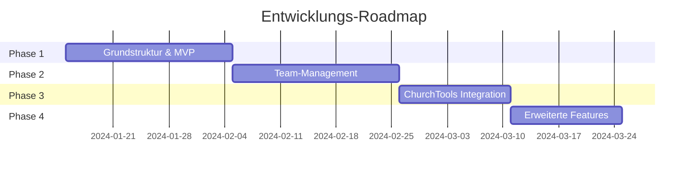
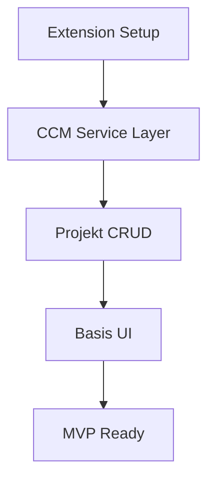
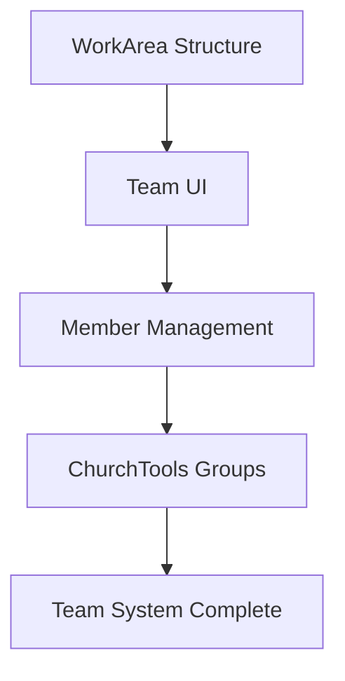
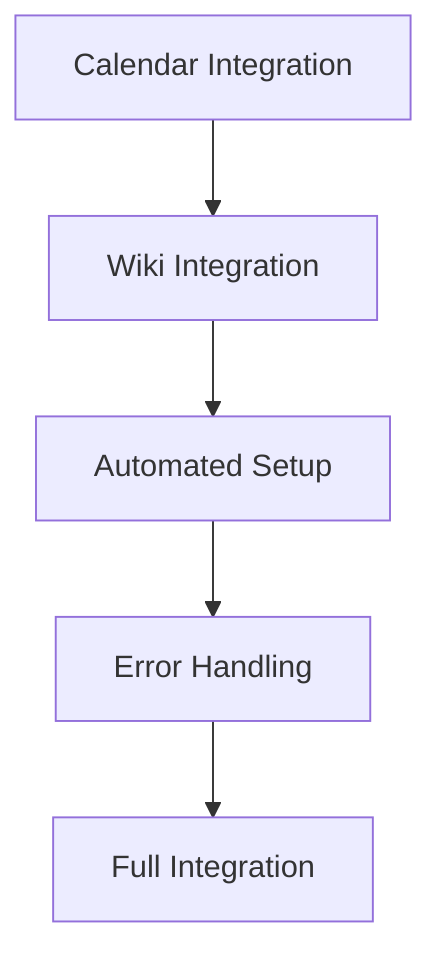
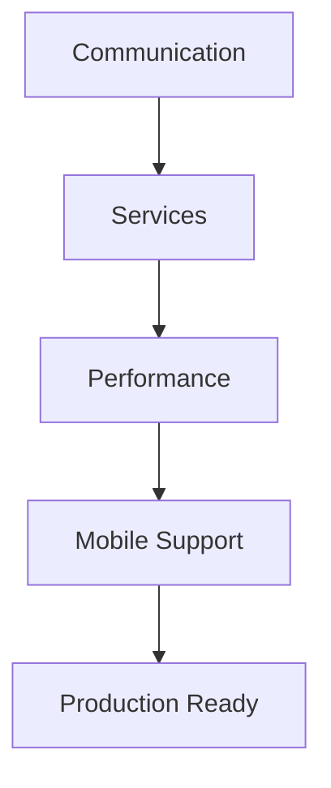
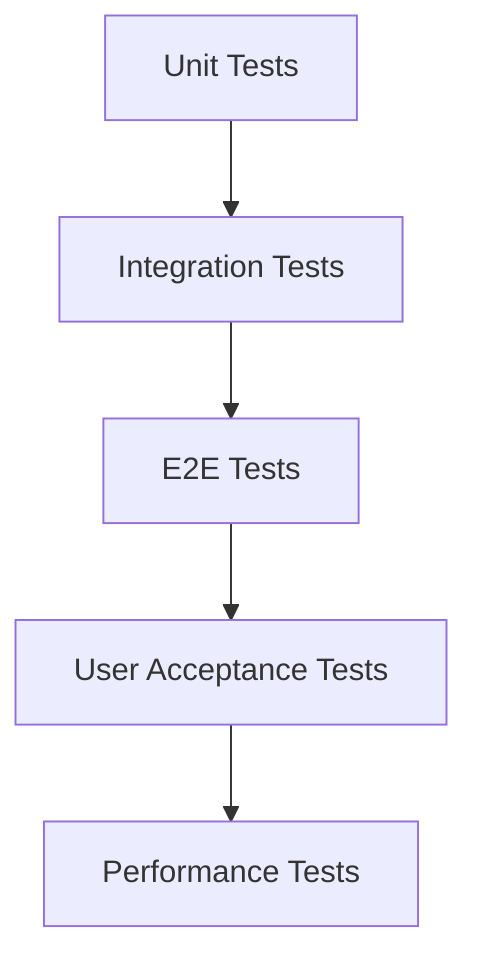

# Implementation Roadmap - ChurchTools Projektorganisation

## Überblick

Die Umsetzung erfolgt in 4 Hauptphasen mit jeweils 2-3 Wochen Entwicklungszeit. Jede Phase liefert funktionsfähige Features und baut auf der vorherigen auf.



## Phase 1: Grundstruktur & MVP (3 Wochen)

### Ziele
- Funktionsfähige Basis-Extension
- Projekt-CRUD-Operationen
- Setup-Wizard Grundfunktionen
- CCM API Integration

### Deliverables

#### Woche 1: Extension-Grundlage
- [ ] Extension-Boilerplate Setup
- [ ] CCM API Service Layer
- [ ] Basis-Datenstrukturen
- [ ] Projekt-Metadaten Management

```typescript
// Minimal viable data structure
interface ProjectMeta {
  type: "project_meta"
  name: string
  description: string
  status: "planning" | "active" | "completed"
  leaderId: number
  createdAt: string
}
```

#### Woche 2: Projekt-Management
- [ ] Dashboard mit Projektliste
- [ ] Projekt erstellen/bearbeiten
- [ ] Projekt-Detailansicht (Basis)
- [ ] Status-Management

#### Woche 3: Setup-System
- [ ] Setup-Todo Datenstruktur
- [ ] Setup-Wizard UI
- [ ] Basis-Setup-Aktionen
- [ ] Abhängigkeits-Management

### Akzeptanzkriterien
- ✅ Benutzer kann Projekte erstellen und verwalten
- ✅ Setup-Wizard zeigt Aufgaben an
- ✅ Daten werden in CCM API gespeichert
- ✅ Basis-Berechtigungen funktionieren

## Phase 2: Team-Management (3 Wochen)

### Ziele
- Vollständiges Arbeitsbereich-Management
- Mitglieder-Verwaltung
- Hierarchische Team-Strukturen
- ChurchTools-Gruppen Integration

### Deliverables

#### Woche 1: Arbeitsbereich-Grundlagen
- [ ] WorkArea-Datenstruktur
- [ ] Team-Erstellung UI
- [ ] Basis-Mitgliederverwaltung
- [ ] Team-Übersicht

#### Woche 2: Erweiterte Team-Features
- [ ] Hierarchische Teams (Parent/Child)
- [ ] Rollen und Berechtigungen
- [ ] Budget-Verwaltung
- [ ] Aufgabenbereiche-Management

#### Woche 3: ChurchTools-Gruppen Integration
- [ ] Automatische Gruppenerstellung
- [ ] Gruppen-Synchronisation
- [ ] Mitglieder-Sync mit ChurchTools
- [ ] Berechtigungs-Mapping

### Akzeptanzkriterien
- ✅ Teams können erstellt und verwaltet werden
- ✅ Mitglieder können Teams zugeordnet werden
- ✅ ChurchTools-Gruppen werden automatisch erstellt
- ✅ Hierarchische Team-Strukturen funktionieren

## Phase 3: ChurchTools Integration (2 Wochen)

### Ziele
- Vollständige ChurchTools-Integration
- Kalender-Management
- Wiki-Integration
- Automatisierte Setup-Aktionen

### Deliverables

#### Woche 1: Kalender & Wiki
- [ ] Kalender-Konfiguration
- [ ] Automatische Kalender-Erstellung
- [ ] Wiki-Struktur-Management
- [ ] Wiki-Seiten-Erstellung

#### Woche 2: Automatisierung
- [ ] Automatische Setup-Aktionen
- [ ] ChurchTools API Wrapper
- [ ] Fehlerbehandlung und Rollback
- [ ] Integration-Tests

### Akzeptanzkriterien
- ✅ Kalender werden automatisch erstellt
- ✅ Wiki-Struktur wird generiert
- ✅ Setup-Aktionen laufen automatisch
- ✅ Fehler werden korrekt behandelt

## Phase 4: Erweiterte Features (2 Wochen)

### Ziele
- Kommunikations-Features
- Dienste-Integration
- Performance-Optimierung
- Erweiterte UI-Features

### Deliverables

#### Woche 1: Kommunikation & Dienste
- [ ] Kommunikations-Konfiguration
- [ ] Dienste-Management
- [ ] Benachrichtigungs-System
- [ ] Chat-Integration

#### Woche 2: Optimierung & Polish
- [ ] Performance-Optimierung
- [ ] Erweiterte Such-/Filterfunktionen
- [ ] Bulk-Operationen
- [ ] Mobile-Optimierung

### Akzeptanzkriterien
- ✅ Kommunikationskanäle funktionieren
- ✅ Dienste können geplant werden
- ✅ Performance ist optimiert
- ✅ Mobile Nutzung ist möglich

## Technische Meilensteine

### Meilenstein 1: CCM API Foundation


### Meilenstein 2: Team Management


### Meilenstein 3: Integration Complete


### Meilenstein 4: Production Ready


## Risiken und Mitigation

### Technische Risiken

| Risiko | Wahrscheinlichkeit | Impact | Mitigation |
|--------|-------------------|---------|------------|
| CCM API Limits | Mittel | Hoch | Caching, Batch-Operations |
| ChurchTools API Changes | Niedrig | Hoch | Wrapper-Layer, Versionierung |
| Performance Issues | Mittel | Mittel | Lazy Loading, Optimierung |
| Browser Compatibility | Niedrig | Niedrig | Modern Browser Support |

### Projekt-Risiken

| Risiko | Wahrscheinlichkeit | Impact | Mitigation |
|--------|-------------------|---------|------------|
| Scope Creep | Hoch | Mittel | Klare Phase-Abgrenzung |
| User Feedback Changes | Mittel | Mittel | Iterative Entwicklung |
| Resource Constraints | Niedrig | Hoch | Priorisierung, MVP-Fokus |

## Qualitätssicherung

### Testing-Strategie


### Code Quality
- TypeScript strict mode
- ESLint + Prettier
- Vue 3 Composition API
- Tailwind CSS Standards

### Review Process
- Feature Branch Development
- Pull Request Reviews
- Automated Testing
- Manual QA Testing

## Deployment-Strategie

### Entwicklungsumgebung
- Gitpod Development Environment
- Hot Reload Development Server
- Mock Data für Testing

### Staging-Umgebung
- ChurchTools Test-Instanz
- Echte API Integration
- User Acceptance Testing

### Production-Umgebung
- ChurchTools Extension Store
- Versionierte Releases
- Rollback-Fähigkeit

## Success Metrics

### Technische Metriken
- API Response Time < 500ms
- UI Load Time < 2s
- Error Rate < 1%
- Test Coverage > 80%

### Business Metriken
- User Adoption Rate
- Feature Usage Statistics
- User Satisfaction Score
- Support Ticket Volume

Diese Roadmap bietet eine strukturierte Herangehensweise für die erfolgreiche Umsetzung der ChurchTools Projektorganisation-Extension.