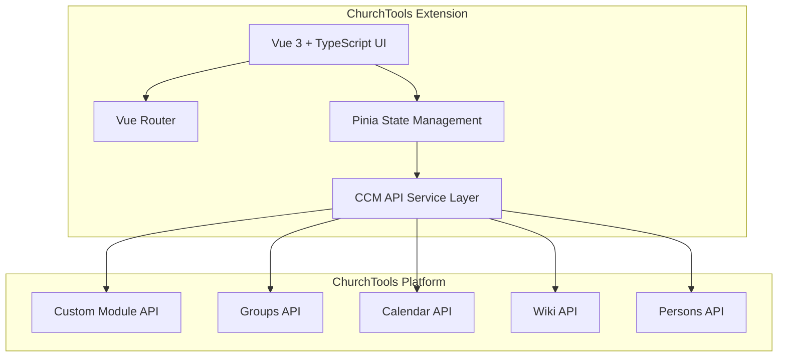
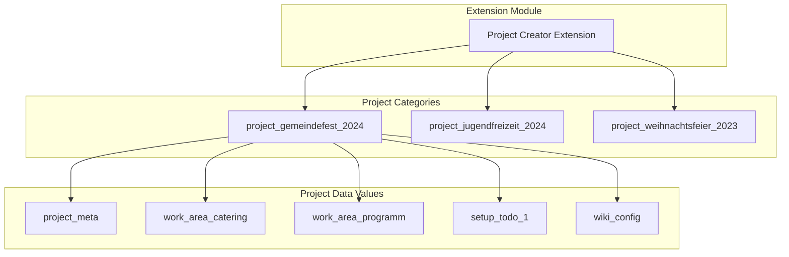
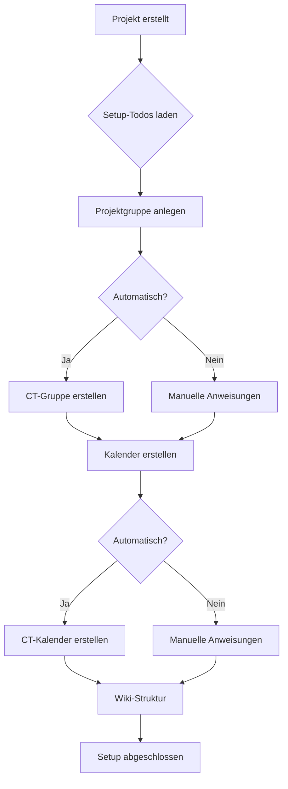
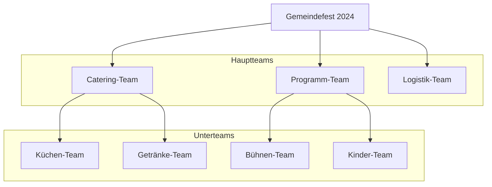
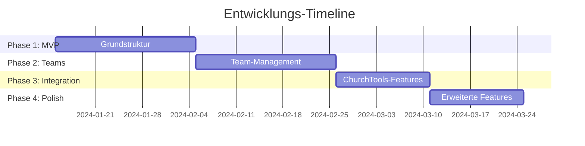
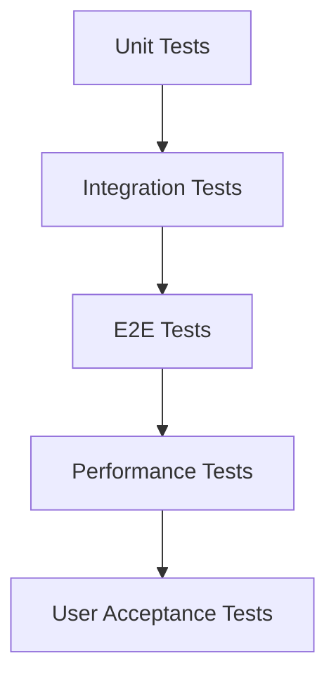
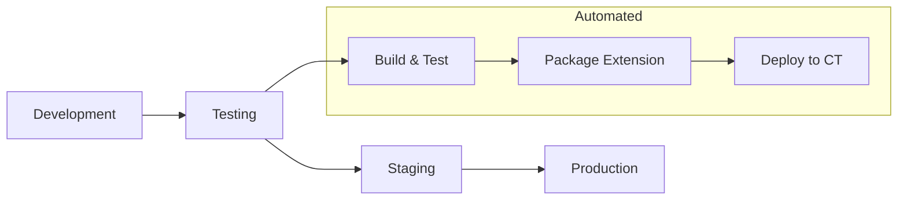
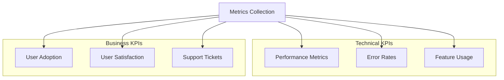

# Umsetzungskonzept: ChurchTools Projektorganisation Extension

## Executive Summary

Dieses Dokument beschreibt das vollständige Umsetzungskonzept für die ChurchTools Projektorganisation Extension basierend auf dem [Lastenheft](./lastenheft.md). Die Lösung nutzt die ChurchTools CCM API als Key-Value Store und bietet eine moderne, benutzerfreundliche Oberfläche für komplexe Projektorganisation.

## 1. Architektur-Überblick



### Technologie-Stack
- **Frontend**: Vue 3 + TypeScript + Tailwind CSS
- **State Management**: Pinia
- **Routing**: Vue Router 4
- **Build Tool**: Vite
- **Testing**: Vitest + Vue Test Utils
- **API Integration**: ChurchTools CCM API

## 2. Datenarchitektur

### Key-Value Store Konzept

Jedes Projekt erhält eine eigene `CustomDataCategory` für optimale Berechtigungsverwaltung:



### Datenstrukturen

Detaillierte Datenstrukturen sind in [data-structures.md](./data-structures.md) dokumentiert.

**Kern-Datentypen:**
- `project_meta`: Projekt-Stammdaten
- `work_area_*`: Arbeitsbereiche/Teams
- `setup_todo_*`: Einrichtungsaufgaben
- `wiki_config`: Wiki-Struktur
- `calendar_config`: Kalender-Konfiguration
- `communication_config`: Kommunikations-Setup

## 3. Benutzeroberfläche

### Wireframes

Vollständige Wireframes sind in [wireframes.md](./wireframes.md) dokumentiert.

**Hauptansichten:**
1. **Dashboard**: Projektübersicht mit Such-/Filterfunktionen
2. **Projekt-Details**: Tab-basierte Navigation
3. **Setup-Wizard**: Interaktive Einrichtungsschritte
4. **Team-Management**: Arbeitsbereich-Verwaltung
5. **Integration-Views**: Kalender, Wiki, Kommunikation

### UI-Komponenten-Hierarchie

```mermaid
graph TD
    App[App.vue]
    
    subgraph "Dashboard"
        Dashboard[ProjectDashboard.vue]
        ProjectCard[ProjectCard.vue]
        CreateDialog[ProjectCreateDialog.vue]
    end
    
    subgraph "Project Detail"
        Detail[ProjectDetail.vue]
        Overview[OverviewTab.vue]
        Setup[SetupTab.vue]
        Teams[TeamsTab.vue]
        Calendar[CalendarTab.vue]
        Wiki[WikiTab.vue]
    end
    
    subgraph "Shared Components"
        BaseCard[BaseCard.vue]
        LoadingSpinner[LoadingSpinner.vue]
        Toast[Toast.vue]
    end
    
    App --> Dashboard
    App --> Detail
    Dashboard --> ProjectCard
    Dashboard --> CreateDialog
    Detail --> Overview
    Detail --> Setup
    Detail --> Teams
    Detail --> Calendar
    Detail --> Wiki
```

## 4. CCM API Integration

### API-Strategie

Detaillierte CCM API Strategie ist in [ccm-strategy.md](./ccm-strategy.md) dokumentiert.

**Kern-Prinzipien:**
- Ein Projekt = Eine CustomDataCategory
- Granulare Berechtigungen über Security Levels
- ChurchTools-Referenzen über domainId/domainType
- Lazy Loading für Performance

### Service Layer

```typescript
// Haupt-API Service
class ProjectCCMService {
  // Projekt-Management
  async createProject(data: ProjectCreateData): Promise<string>
  async getProject(categoryId: string): Promise<ProjectData>
  async updateProject(categoryId: string, updates: Partial<ProjectData>): Promise<void>
  async deleteProject(categoryId: string): Promise<void>
  
  // Team-Management
  async addWorkArea(projectId: string, data: WorkAreaData): Promise<string>
  async updateWorkArea(projectId: string, workAreaId: string, updates: Partial<WorkAreaData>): Promise<void>
  
  // Setup-Management
  async getSetupTodos(projectId: string): Promise<SetupTodoData[]>
  async executeSetupAction(projectId: string, todoId: string): Promise<void>
  
  // ChurchTools-Integration
  async createChurchToolsGroup(projectId: string, groupData: any): Promise<number>
  async createChurchToolsCalendar(projectId: string, calendarData: any): Promise<number>
}
```

## 5. Feature-Mapping zum Lastenheft

### Funktionale Anforderungen

| Lastenheft-Anforderung | Umsetzung | Status |
|------------------------|-----------|---------|
| **3.1 Projektanlage** | ProjectCreateDialog + CCM API | ✅ Geplant |
| **3.2 Gruppenmanagement** | Automatische CT-Gruppen-Erstellung | ✅ Geplant |
| **3.3 Wiki-Integration** | Wiki-Config + Auto-Seitenerstellung | ✅ Geplant |
| **3.4 Kalender-Management** | Calendar-Config + Event-Integration | ✅ Geplant |
| **3.5 Kommunikation** | Communication-Config + Chat-Integration | ✅ Geplant |
| **3.6 Dienstplanung** | Service-Config + Dienste-Templates | ✅ Geplant |

### Nicht-funktionale Anforderungen

| Anforderung | Umsetzung | Zielwert |
|-------------|-----------|----------|
| **Performance** | Lazy Loading + Caching | < 2s Ladezeit |
| **Skalierbarkeit** | Key-Value Store + Partitionierung | 1000+ Projekte |
| **Benutzerfreundlichkeit** | Modern UI + Setup-Wizard | < 5 Min Setup |
| **Kompatibilität** | ChurchTools API Integration | Aktuelle CT-Versionen |

## 6. Setup-Wizard System

### Automatisierte Einrichtung



### Setup-Todo Typen

| Todo-Typ | Beschreibung | Automatisierung |
|----------|--------------|-----------------|
| `group` | ChurchTools-Gruppen erstellen | ✅ Vollautomatisch |
| `calendar` | Projekt-Kalender anlegen | ✅ Vollautomatisch |
| `wiki` | Wiki-Seiten-Struktur | ✅ Template-basiert |
| `permissions` | Berechtigungen konfigurieren | ⚠️ Semi-automatisch |
| `communication` | Chat-Kanäle einrichten | ⚠️ Semi-automatisch |
| `services` | Dienste-Kategorien anlegen | ❌ Manuell |

## 7. Team-Management System

### Hierarchische Struktur



### Team-Features

- **Mitgliederverwaltung**: Rollen (Leader, Member, Guest)
- **Budget-Tracking**: Team-spezifische Budgets
- **Aufgabenbereiche**: Flexible Verantwortlichkeiten
- **ChurchTools-Integration**: Automatische Gruppen-Sync

## 8. ChurchTools Integration

### API-Endpunkte Mapping

| Feature | ChurchTools API | Verwendung |
|---------|-----------------|------------|
| **Gruppen** | `/api/groups` | Team-Gruppen erstellen |
| **Kalender** | `/api/calendars` | Projekt-Kalender anlegen |
| **Events** | `/api/events` | Termine verwalten |
| **Wiki** | `/api/wiki/pages` | Dokumentation erstellen |
| **Personen** | `/api/persons` | Mitglieder-Daten |
| **Dienste** | `/api/services` | Dienst-Integration |

### Automatisierte Aktionen

```typescript
// Beispiel: Automatische Gruppenerstellung
async function createProjectGroup(projectData: ProjectData): Promise<number> {
  const groupData = {
    name: `${projectData.name} - Projektteam`,
    groupTypeId: PROJECT_GROUP_TYPE,
    note: projectData.description,
    settings: {
      allowSelfSignup: false,
      isPublic: false
    }
  }
  
  const group = await churchtoolsClient.post('/api/groups', groupData)
  
  // Projektleiter als Admin hinzufügen
  await churchtoolsClient.post(`/api/groups/${group.id}/members`, {
    personId: projectData.leaderId,
    groupTypeRoleId: ADMIN_ROLE_ID
  })
  
  return group.id
}
```

## 9. Implementation Roadmap

Detaillierte Roadmap ist in [implementation-roadmap.md](./implementation-roadmap.md) dokumentiert.

### Phasen-Übersicht



**Meilensteine:**
- **Woche 3**: MVP mit Basis-Projektmanagement
- **Woche 6**: Vollständiges Team-Management
- **Woche 8**: ChurchTools-Integration komplett
- **Woche 10**: Production-Ready Release

## 10. Qualitätssicherung

### Testing-Strategie



**Test-Coverage Ziele:**
- Unit Tests: > 80%
- Integration Tests: Alle API-Endpunkte
- E2E Tests: Kritische User-Journeys
- Performance Tests: < 2s Ladezeiten

### Code Quality Standards

- **TypeScript**: Strict Mode aktiviert
- **ESLint**: Airbnb Config + Vue Rules
- **Prettier**: Automatische Formatierung
- **Husky**: Pre-commit Hooks
- **Conventional Commits**: Standardisierte Commit-Messages

## 11. Deployment & Betrieb

### Deployment-Pipeline



### Monitoring & Support

- **Error Tracking**: Sentry Integration
- **Performance Monitoring**: Web Vitals
- **User Analytics**: Usage Statistics
- **Support**: ChurchTools Forum + Documentation

## 12. Risiken & Mitigation

### Technische Risiken

| Risiko | Impact | Wahrscheinlichkeit | Mitigation |
|--------|--------|-------------------|------------|
| CCM API Limits | Hoch | Mittel | Caching, Batch-Operations |
| ChurchTools API Changes | Hoch | Niedrig | Wrapper-Layer, Versionierung |
| Performance Issues | Mittel | Mittel | Lazy Loading, Optimierung |

### Business Risiken

| Risiko | Impact | Wahrscheinlichkeit | Mitigation |
|--------|--------|-------------------|------------|
| User Adoption | Hoch | Mittel | UX-Fokus, Training |
| Scope Creep | Mittel | Hoch | Klare Phasen-Abgrenzung |
| Resource Constraints | Hoch | Niedrig | MVP-Fokus, Priorisierung |

## 13. Success Metrics

### KPIs

- **Adoption Rate**: > 50% der Zielgruppe nach 6 Monaten
- **User Satisfaction**: > 4.0/5.0 Rating
- **Performance**: < 2s Ladezeit, < 1% Error Rate
- **Feature Usage**: > 80% Setup-Completion Rate

### Monitoring Dashboard



## 14. Fazit

Dieses Umsetzungskonzept bietet eine vollständige, skalierbare Lösung für die ChurchTools Projektorganisation. Die Kombination aus moderner Web-Technologie, durchdachter Datenarchitektur und nahtloser ChurchTools-Integration ermöglicht es Gemeinden, komplexe Projekte effizient zu organisieren und zu verwalten.

**Kernvorteile:**
- ✅ **Benutzerfreundlich**: Moderne UI mit Setup-Wizard
- ✅ **Skalierbar**: Key-Value Store Architektur
- ✅ **Integriert**: Nahtlose ChurchTools-Integration
- ✅ **Flexibel**: Modularer Aufbau und Erweiterbarkeit
- ✅ **Wartbar**: Saubere Code-Architektur und Testing

Die schrittweise Umsetzung in 4 Phasen minimiert Risiken und ermöglicht frühes User-Feedback für kontinuierliche Verbesserungen.